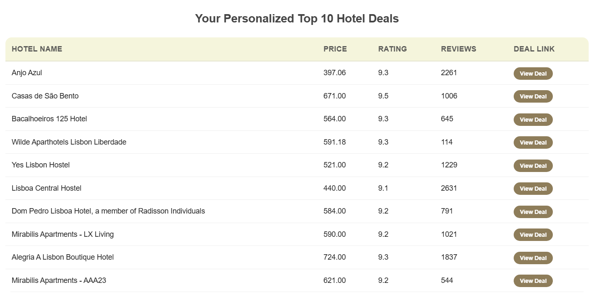

# Hotel Deal Engine & Data Pipeline

## Project Overview
A high-performance data pipeline designed to scrape, match, and analyze hotel data from multiple industry leaders. The system orchestrates two distinct scraping architectures to provide a unified view of the travel market, enabling complex business intelligence, price comparison, and automated delivery—concluding with a report of the top 10 high-value deals sent directly to the user's inbox.

---

## Reverse Engineering & Architecture
* **Booking.com Engine:** Developed through advanced web-traffic analysis and structural reverse engineering. This engine bypasses complex dynamic rendering challenges and manages session states to ensure consistent data extraction without relying on official APIs.
* **Agoda Engine:** A sophisticated hybrid crawler built on **Scrapy**, integrated with **Playwright (Headless Browser)**. This architecture was specifically designed to handle Agoda’s complex Javascript-heavy DOM and dynamic content loading, ensuring high-fidelity data capture while maintaining crawl efficiency.
* **Unified Processing:** The system utilizes **Fuzzy Logic (Levenshtein Distance)** for cross-platform entity resolution and distance-based verification, transforming fragmented raw data into a single, clean, and visualization-ready Master Report.

---

## Features
* **Dual-Engine Scraping:** Simultaneous data extraction from Booking.com and Agoda.
* **Intelligent Entity Matching:** Advanced "Fuzzy Matching" and geographic distance validation to identify identical hotels across different platforms.
* **Automated Price Comparison:** Automatically identifies the cheapest available deal and provides the direct URL.
* **Statistical Reliability:** Prioritizes ratings from sources with the highest review counts to ensure data integrity.
* **Dynamic Business Filtering:** User-defined thresholds for:
    * Maximum Price
    * Maximum Distance from City Center (KM)
    * Minimum Rating Score
    * Minimum Reviews Count
* **Visual-Ready Metrics:** Built-in feature engineering including Value Scores, Popularity Tiers, and Location Categorization.

---

## Project Structure
```text
hotel_scraper_project/
│
├── main.py                     # Entry point - Orchestrates the scraping pipeline
├── .env                        # Environment variables (Secrets & Config)
├── .gitignore                  # Git exclusion rules
├── requirements.txt            # Project dependencies
├── README.md                   # Project documentation
│
├── scripts/                    # Core logic and processing
│   ├── __init__.py
│   ├── main_booking.py         # Booking.com execution logic
│   ├── main_agoda.py           # Agoda execution logic
│   ├── data_processor.py       # Data matching & business logic
│   ├── utils.py                # Helper functions
│   └── email_service.py        # Email Sender
│
├── engines/                    # Scraping engine implementations
│   ├── __init__.py
│   ├── booking_engine.py       # Booking.com extraction engine
│   └── agoda_engine.py         # Agoda extraction engine
│
├── authentication/             # Sensitive credentials (Ignored by Git)
│   ├── auth_booking.json
│   ├── auth_agoda.json
│   └── authenticator.py
│
├── outputs/                    # Generated reports
│   ├── READY_FOR_VISUALIZATIONS.xlsx
│   ├── MASTER_REPORT_FILTERED.xlsx
│   ├── MASTER_REPORT_FULL_RAW.xlsx
│   ├── matching_technical_details.xlsx
│   ├── final_data_agoda.xlsx
│   └── final_data_booking.xlsx
│
└── logs/                       # System and error logs
    ├── scraper_booking.log
    ├── scraper_agoda.log
```

## Getting Started

### Prerequisites
* Python 3.8 or higher
* Chrome Browser (for Selenium-based scrapers)

### Installation
1. **Clone the repository:**
   ```bash
   git clone [https://github.com/liorkrem/travel-deal-engine](https://github.com/liorkrem/travel-deal-engine)
   cd hotel-scraper

### Installation
2. **Install dependencies:**
   ```bash
   pip install -r requirements.txt

### Running the System
Execute the main pipeline:
```bash
python main.py
```
Follow the on-screen prompts to enter city name, dates, and your specific business filters.


---

## Data Processing Pipeline
The system follows a strict **ETL (Extract, Transform, Load)** workflow:

1. **Normalization:** Cleaning hotel names by removing noise words (e.g., "Resort", "Spa") and standardizing numeric values.
2. **Matching:** Cross-referencing datasets using the `thefuzz` library with a distance-tolerance threshold.
3. **Consolidation:** Merging records into a single "Source of Truth".
4. **Enrichment:** Calculating the Value Score using the formula:
   $$Value\_Score = \frac{Rating}{Price / Average\_City\_Price}$$

---

## Output Descriptions
* **READY_FOR_VISUALIZATIONS.xlsx:** The final product. Contains the best deals matching all user criteria, enriched with visualization metrics.
* **MASTER_REPORT_FILTERED.xlsx:** Contains the best deals matching all user.
* **MASTER_REPORT_FULL_RAW.xlsx:** A complete archive of all found hotels from both sources, merged but unfiltered.
* **matching_technical_details.xlsx:** An audit log for developers showing fuzzy match scores and distance deltas for every matched pair.
* **final_data_booking.xlsx**
* **final_data_agoda.xlsx**

> *This project is for educational/research purposes.*

---

## Visualizations
The visualization below demonstrates a multi-dimensional analysis of the Lisbon hotel market. The **X-axis** represents the price per night, while the **Y-axis** shows the hotel rating. To provide deeper business insights, the **marker size** indicates proximity to the city center (larger markers are more central), and the **color gradient** represents my custom **Value Score**—ranging from green (high value-for-money) to red. This visualization allows for the immediate identification of **outliers**: high-rated hotels offered at a significantly lower market price.


---

## Automated Reporting
To streamline the decision-making process, the system includes an automated email service. Once the analysis is complete, a beautifully formatted **HTML report** is dispatched to the user. This report summarizes the **Top 10 Deals** found, featuring a clean tabular view of prices, ratings, and direct links to the hotel pages. This ensures that the most relevant business intelligence is delivered directly to your inbox, ready for immediate action.

